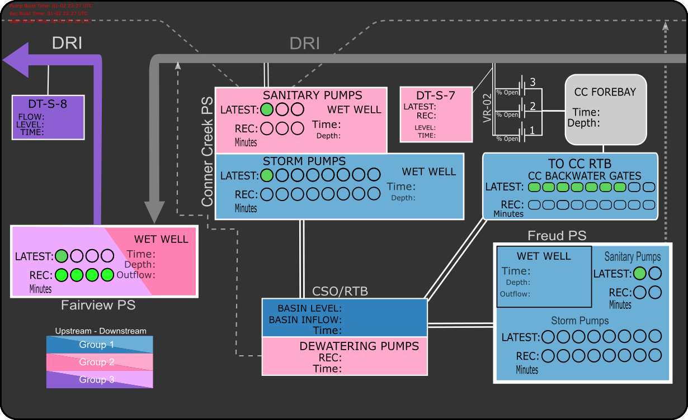
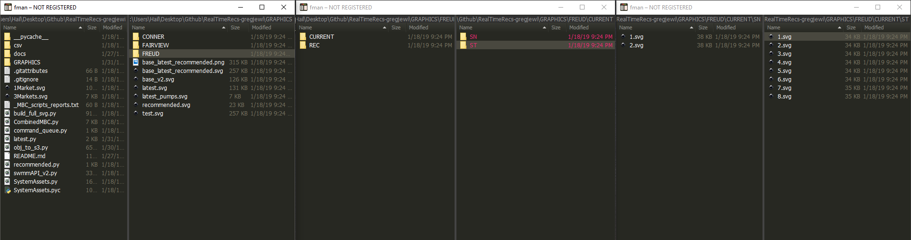
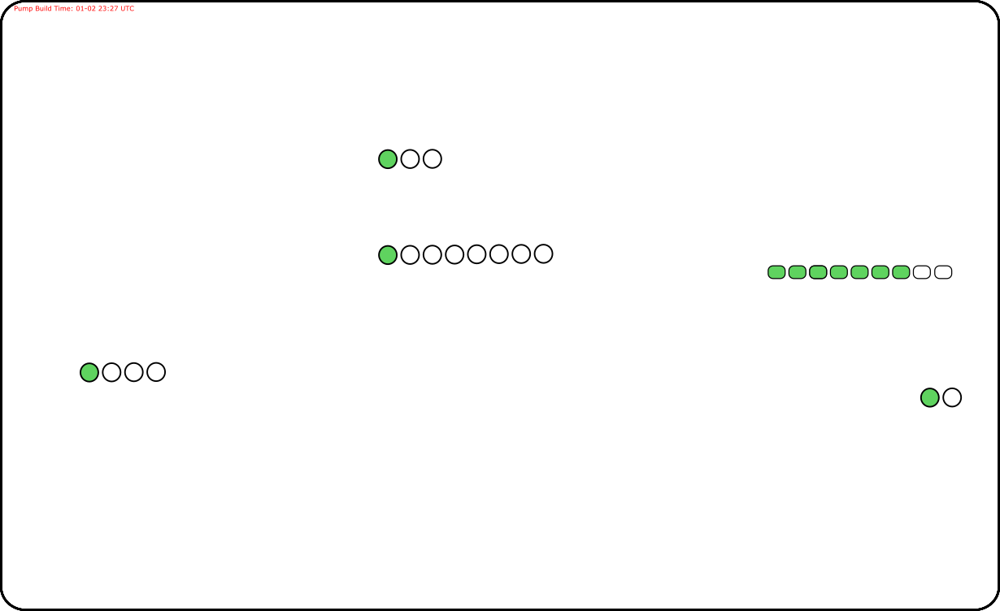

.. contents::
   :depth: 3

================================
Building SVG Dashboard Graphics
================================

Here we will cover the scripts that builds the real-time graphic used as part of the grafana dashboard (seen below.) 

	Example output of the scripts.

Scripts Called
================

Together, three scripts and a command line operation in ``command_queue.py`` build the real-time graphic. These calls are:

.. code-block:: python

	python latest.py
	python recommended.py
	python build_full_svg.py
	inkscape --export-png=/out/path/here.png /input/path/here.svg

Graphics File Structure
=========================

First, however, it is worthwhile to discuss the directory and file structure that these scripts leverage to build the graphics.

Essentially, what these scripts do is select object layers within pre-built ``.svg`` files and stack those layers on top of the default base layer. Once these layers are collected into a single file, it is then exported as a ``.png`` file for upload to the cloud.

Navigating from the root directory of the repo, the file structure for the graphics is:
``.\GRAPHICS\{Pumpstation Name}\{Current Or Recommendation}\{Wet Well}\{# of Pumps}.svg``

Where:

- ``{Pumpstation Name}`` is the same name used for the measurement name during the database query (ex. FAIRVIEW)
- ``{Current Or Rec}`` refers to whether the path is for a real or recommended state
- ``{Wet Well}`` refers to the location within the pump station, as many of the stations have both a sanitary (SN) and storm (ST) wet wells. (CONNER folder has an additional term for the sewer gates (SG) because that gates are associated with the measure.)
- ``{# of Pumps}.svg`` is the file which corresponds to a given number of pumps ``ON`` for a wet well, either recommended or real, for a pumpstation.

For example, if the control engine were recommending Conner Creek Pump Station have five, 5, of its storm pumps ``ON``, then the file to include in the build of the dashboard for this information would be:

``.\GRAPHICS\CONNER\REC\ST\5.svg``

	Example file structure of GRAPHICS\ directory.

latest.py
===============
``latest.py`` first establishes a connection with the InfluxDB instance and processess the database field(s) to query.

.. literalinclude:: C:\Users\Hail\Desktop\Github\RealTimeRecs-gregjewi\latest.py
	:lines: 12-15

Next, we instantiate our pumpstation objects.

.. literalinclude:: C:\Users\Hail\Desktop\Github\RealTimeRecs-gregjewi\latest.py
	:lines: 18-21

Using the method ``.query_measures()``, pump and gate measurements are queried from the database. 
The ``.pumps_running()`` method counts and stores the number of pumps for each station that have the status ``ON``. 
Likewise, the ``.gates_open()`` accomplishes the same task, but for gates. 
With the number of pumps and gates of status ``ON`` known, the corresponding ``.svg`` filenames for each pumpstation is collected in the list ``add_to_base``. 
This all is accomplished in the for loop below.

.. literalinclude:: C:\Users\Hail\Desktop\Github\RealTimeRecs-gregjewi\latest.py
	:lines: 23-45

Next, using the module ``svgutils``, the ``.svg`` are loaded into an object ``layer`` and is appended into a list. 
The contents of the list are combined and saved to the file ``latest.svg``.  
The result is a file with green objects that correspond to the number of pumps or gates ``ON`` at pumpstations across the network. 
An example is below.

	
	*Sample output of* ``latest.py``

recommended.py
====================
``recommended.py`` performs the same procedure as ``latest.py``. The difference is instead of building an ``.svg`` file corresponding to the latest states in the system it builds an ``.svg`` file corresponding to the most recent *recommended* states as determined by the control calculations in :doc:`CombinedMBC`. An example is below.

	
	*Sample output of* ``recommended.py``

build_full_svg.py
=======================

``build_full_svg.py`` takes the objects located in ``latest.svg`` and ``recommended.svg`` and adds them to the base layer in ``base_v2.svg``. The result can be seen in the figure below.

	Completed output of scripts.

.. literalinclude:: C:\Users\Hail\Desktop\Github\RealTimeRecs-gregjewi\build_full_svg.py

Inkscape Command Line
=======================

Finally,

``inkscape --export-png=/PATH/TO/GRAPHICS/base_latest_recommended.png /PATH/TO/GRAPHICS/base_latest_recommended.svg``

converts the ``.svg`` output into a ``.png`` file. Learn more about `Inkscape here <https://inkscape.org/>`_.