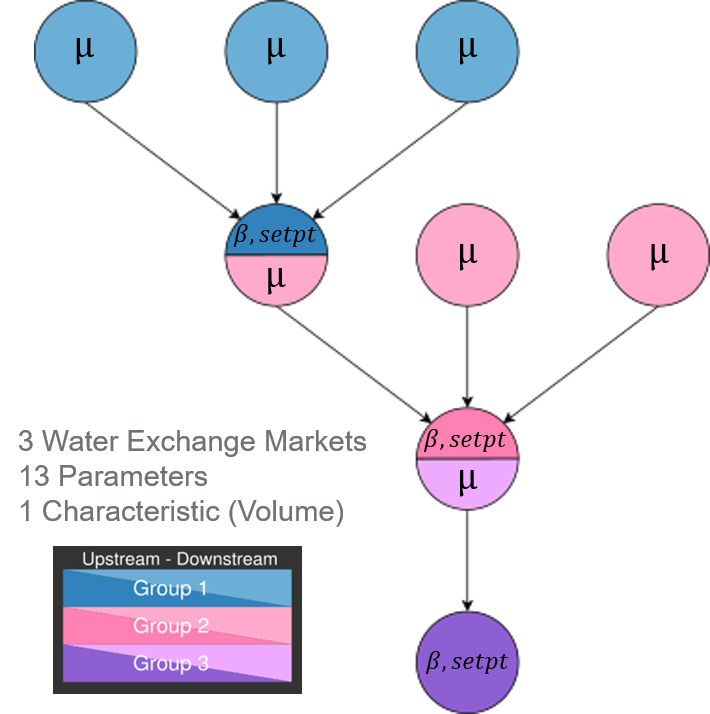
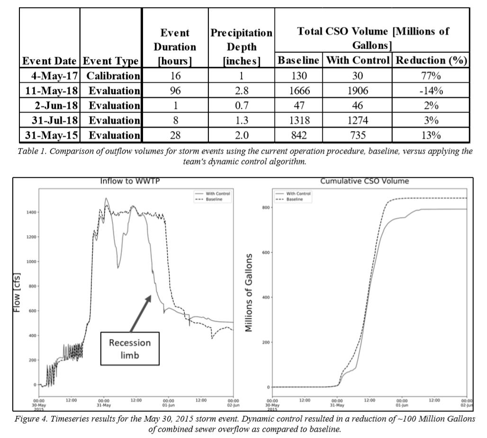

.. image:: images/LOGOS.png

Determing Parameters to Use in Water Exchange Market Price Calculations
=======================================================================

At the highest level, our objective is to improve the water quality of receiving bodies in the urban hydrosphere.
Practically this statement could mean different things for different systems, requiring different solutions.
Likewise, the method for evaluating success of a solution can differ.
For example, a solution to improve water quality of a receiving water body could be evaluated on its ability to: reduce CSO volumes or events; deliver near-steady state inflow to the WRRF; supply the WRRF with influent that satisfies a desired concentration profile; reduce real cost.

Our formulation of Water Exchange Markets to dictate dynamic control of the stormwater assets is a proposed *solution* to achieve the *objective* of improving water quality of receiving water bodies.
For the GLWA Eastside application, evaluation of performance is done by comparing the solution's ability to reduce the volume and event occurrence of CSOs throughout the system.

Water Exchange Market Parameters
--------------------------------

In the formulation of the :doc:`WaterExchangeMarket`, there are three types of parameters that are user-defined:

* :math:`\mu` is the weighting parameter for an upstream agent characteristic
* :math:`\beta` is the weighting parameter for a downstream location characteristic, and
* :math:`setpt` is the user-defined setpoint for a downstream location characteristic [#]_.

.. [#] There is also the possibility for a user to define the behaviour of the "Central Bank", though this is a complication that will not be covered here.

The values -- and their relations to each other -- of these user-defined parameters help determine the purchasing power assets have in an exchange and, subsequently, the amount of water they can release at any given time.
Therefore, performance of the control engine depends on the values of these parameters.

The determination of these parameters, however, is a nontrivial task due to the complexity of the stormwater systems, layers of exchange markets, and changing inputs into the system (i.e. unique precipitation events.)
For these reasons it is nearly impossible to know *a priori* which set of parameters will perform best for any give strorm [#]_.
Therefore, a methodology is required to explore parameter sets and evaluate their performance under a number of conditions.

.. [#] The idea of "best" is a fuzzy one and requires more discussion. For now, the "best" set of parameters is the set that performs best compared to all other sets that 

The questions we set out to answer are:

	1. Given a storm event, what set of market parameters would result in the best *global* outcome of the system?
	2. Repeating the above step over multiple storms, of varying intensities and durations, does there exist a set of parameters that perform well for all storm types?

	
	*In this tree representation of our control points, it's easy to see the different parameter values that require assignment.*

Methodology
------------------

We used a genetic algorithm [#]_ to iteratively explore market-based control parameter combinations in model space using an EPA SWMM input file representing a portion of the GLWA combined sewer collection system.
Control actions were made during simulations via `PySWMM <https://github.com/OpenWaterAnalytics/pyswmm>`_ , a Python language SWMM wrapper.
The choice of assets to control was made in consultation with the stormwater operations team and through inspection of the gates, pumps, and valves within the physical system and the model.
Simplifications were made in the model when the level of detail was not necessary for control. 

To rank the parameter sets, we used two criteria:

	1. Minimize total volume of discharge through modeled outfalls **not** associated with the WRRF, and [#]_
	2. Minimize the total number of timesteps that model elements are above basement flooding warning elevtions.

These criteria allowed for comparison between parameter combinations.
Results presented were generated using parameter values identified using a genetic algorithm on a single storm of one-inch depth and 16-hour duration. 

Performance of the control (and the parameter combination) for an event was compared with a baseline value, calculated by running the simulation with an unaltered version of the SWMM input file developed by the Authority and its consulting engineers.
This model reflects current operating procedure and can be considered current “best practice” by GLWA. 
During calibration we achieved a 77% reduction in combined sewer overflows using our market-based control algorithm and the best parameters found from the genetic algorithm.
These parameters were then used to make control decisions during simulation of 4 new events. 
A summary of results can be found in the table below.

The figure demonstrates the impact of our control approach on the inflow to the wastewater treatment plant and the volume of combined sewer overflows over the course of a storm event compared to the baseline scenario. 
During this event, there is a reduction in CSO volume of approximately 100 million gallons, around 13% compared to the baseline case. 
Additionally, focusing on the inflow to the treatment plant, the recession limb trails off more quickly and maintains a constant value of approximately 500 cfs at the end of the storm event, indicating that we can quickly stabilize to an inflow setpoint. 
Similar results were observed for other storm events, with the exception of the 11-May-18 storm event listed in Table 1. 
We hypothesize that this is due to the identification of parameters via a genetic algorithm trained on a singlestorm event of certain characteristics. 
Note that the duration and total precipitation depth for these events are very different and thus the parameters identified by the genetic algorithm do not likely to be optimal for rain events of this nature. 

Moreover these results were achieved simply by using the storage capacity already present in the system, meaning no major capital investments from the stormwater authority would be required to have a significant impact on both CSO volume reduction and equalization of inflows to the treatment plant. 

.. note:: More information on methodology and analysis can be found in :doc:`SupportingDocumentation`

.. [#] More on genetic algorithms `here <https://en.wikipedia.org/wiki/Genetic_algorithm>`_ .
.. [#] This is an important distinction to make in the results of our study. In reality there is a hierarchy for permitted discharges, as flows discharged via certain outfalls receive approximately primary treatment. 

.. **Complex Networks**: Real stormwater networks are complex, where interactions within the system are poorly understood and highly non-linear. 
.. **Multi-Layered Exchange Markets**: In complex stormwater networks it makes sense to simplify the problem by creating submarkets of assets contributing to common downstream locations. With nested and layered markets, it is hard to determine what the outcome of the parameters will be.
.. **Changing Inputs**: No two precipitation events are exactly alike in intensity, duration, or location. One parameterization may be more effective with one type of storm over another.
.. Experimentation with varying numbers of exchanges for the GLWA Eastside system has provided some evidence that multiple, nested markets provide more responsiveness to upstream agents compared to all agents competing in a single exchange.