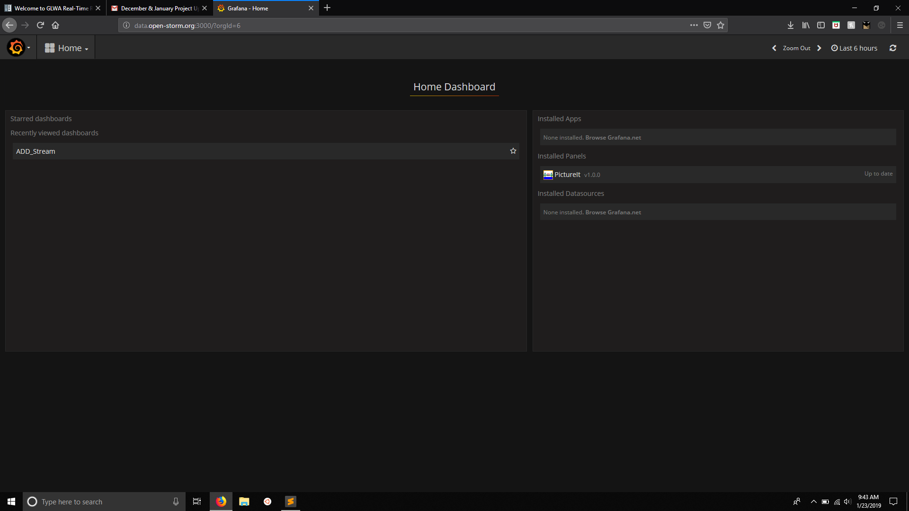
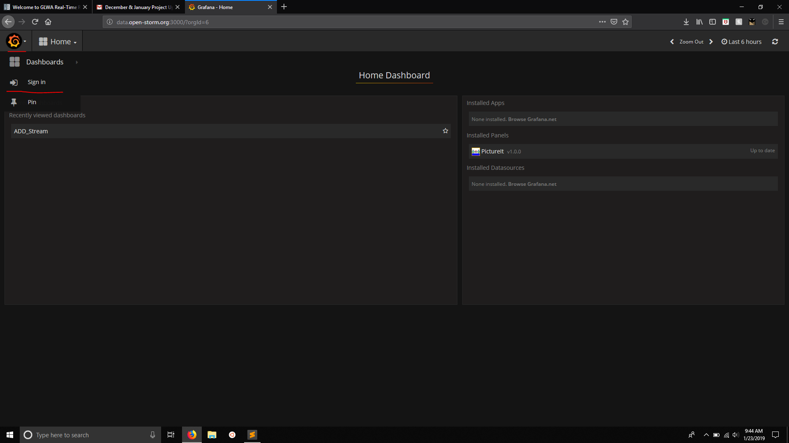
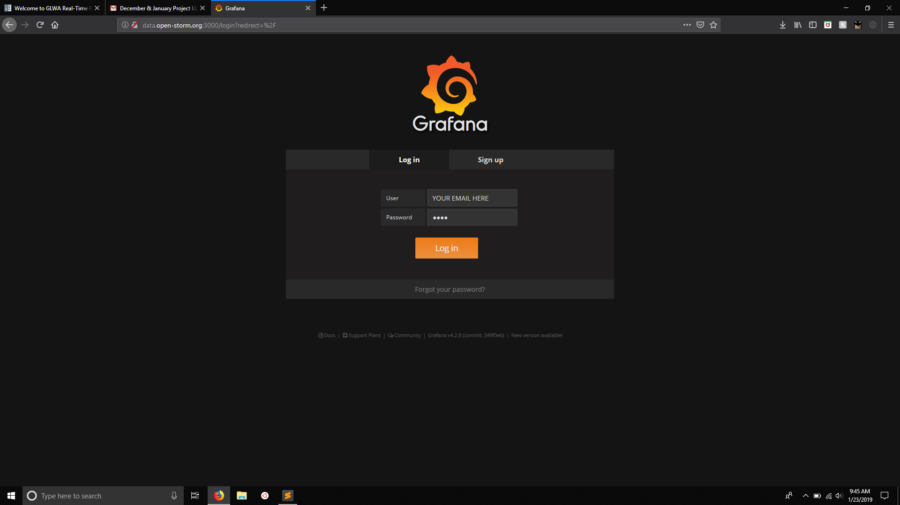
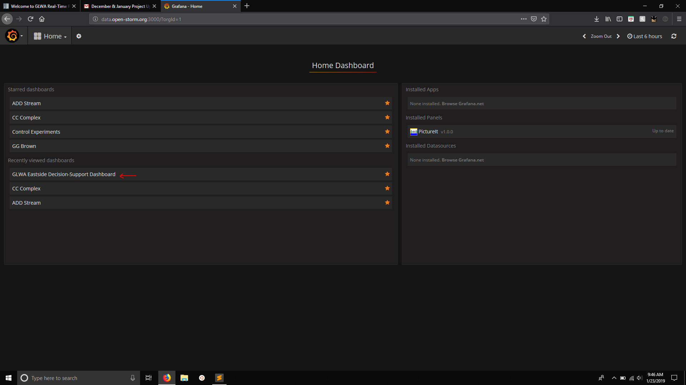
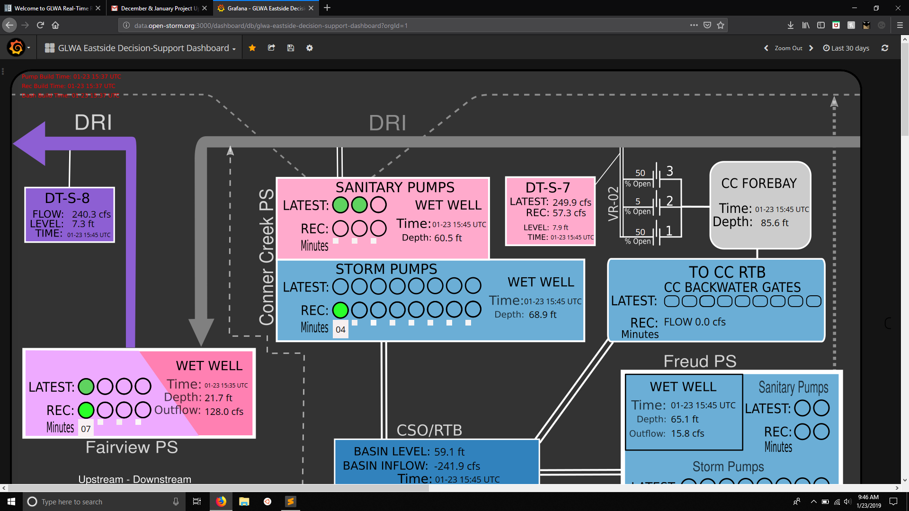

Logging in to Open-Storm Grafana Page
=====================================

.. image:: images/LOGOS.png

Follow these steps to login to Grafana and access the GLWA Eastside Decision Support Dashboard.

1. Navigate to the `Grafana port at Open Storm <http://data.open-storm.org:3000/>`_. If you're not logged in yet, it should look something like this:

2. Click on the Grafa logo in the upper lefthand corner, then click the "Sign in" button.

3. Enter your credentials to login to the site.

4. Navigate to the GLWA Eastside Decision-Support Dashboard. For many, this may be the Home dashboard for many. If so, you're done!

5. Use the Dashboard.

