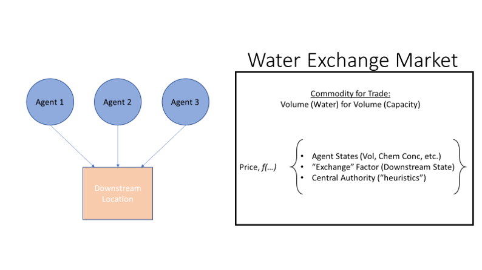

Water Exchange Market
=====================

.. image:: images/LOGOS.png

To Branko and Co.,

*Sara (T) let me know that you are in a process of developing new terminology for our control algorithm (formerly 'Market-Based Control'.)*
*A productive Slack chat with Sara led me down a rabbit hole of economics terms on Wikipedia.*
*Let this page serve as my contribution to the terminology conversation.*

**TL;DR, Summary:** What we have done up to now is consistent with economic concepts of an exchange *AND* what we have talked about going forward has ready corollaries in economic exchanges.

Begin...

I don't think we are too far off with the 'Market' analogy.
What I am proposing is that we name the "thing" we created the **Water Exchange Market**, or something that has the same connotations of an `Exchange <https://en.wikipedia.org/wiki/Exchange_(organized_market)>`_ in economics.

Why do I think this?
Regardless of how we determine price (depth, volume, inflow, derivatives, concentrations, etc.,) ultimately the action will be to release a discrete packet (or volume) of water.
These packets/volumes of water are `Commodities <https://en.wikipedia.org/wiki/Commodity>`_ by the economic definition in that they are fungible; meaning that the market treats the good as equivalent or nearly so with no regard to who produced them. 
This is mostly true because we don't think of the water from one control point being a different good than one released from a different control point.

What's efficient about continuing to think of water as a commodity is because we can build upon that to create a virtual `Commodity Market <https://en.wikipedia.org/wiki/Commodity_market>`_.
Likewise, we can think of the decision-making or exchange tools as corollaries to existing financial instruments such as spot-prices, derivatives, forwards, futures, options, etc.
If we use these terminology then the decision-support tool I have built for GLWA is an Exchange for `spot transactions <https://en.wikipedia.org/wiki/Spot_contract>`_, where the tade is settled before the next decision timestep.

As well, we can rely on the accepted paradigms of determining market prices. 
From the Commodity page of the Wiki: *the price of a commodity is typically determined as a function of its market as a whole*.
This squares with what we want to do with the idea of pricing.
To date, we have experimented with our pricing as a function of upstream and downstream states of different characteristics (volume and TSS,) *and* the derivatives of these characteristics.
As we expand to incorporate water quality characteristics into the decision engine, we can think of the price as a `Commodity Price Index <https://en.wikipedia.org/wiki/Commodity_price_index>`_.
Further, we can think of the heuristics that we employ (e.g. if upstream volume > 0.95, then release water) as a power that a central authority, a la the Federal Reserve, exerts to influence the market or price of the market.
(Thought: to be intellectually consistent, instead of having the release be hard-coded after a heuristic is met, maybe we manipulate the *price* such that the flooding upstream agent can make a trade?)

Same Math, New Terms
--------------------

**Agents** are upstream locations that have a control volume and control point associated with it.
For every agent, :math:`i`, we can define their wealth, :math:`W_i`, as a function of their *normalized* characteristic states.
In the simplest case of the single characteristic of volume, wealth can be defined as:

:math:`W_i = \mu_i \times V_i`

	Where:
	 * :math:`\mu_i` is a weighting parameter, and
	 * :math:`V_i` is the volume within the control volume, normalized to the maximum volume possible within the control volume.

Wealth of any agent can be calculated using a variety of different characteristics in a variety of forms.
We haven't (yet) experimented with wealth formulations which are not linear, but we could explore it.
Practical limitation to the number of agent characteristics included in the Wealth calculation is the total number of characteristics measured in your system at all agent locations.

The price of the traded commodity (in this case Volume), :math:`P_V`, in an exchange is:

:math:`P_V = \frac{\sum_{i=1}^{n} W_i + EF}{n + 1}`

	Where:

	* :math:`\sum_{i=1}^{n} W_i` is the sum of wealth of all the agents active in the Exchange,
	* :math:`n` is the total number of agents active in the exchange, and
	* :math:`EF` is the *Exchange Factor*. (In previous versions, this is the downstream term.)

:math:`EF` should account for market conditions not associated with agent characteristics. 
These could include conditions at the downstream, WRRF, or outfalls. 
One way to define :math:`EF` is

:math:`EF = (V_{down} - setpt) \times \beta`

	Where:

	* :math:`V_{down}` is the measured normalized volume at the downstream
	* :math:`setpt` is the operator-defined setpoint (normalized) for the downstream, and
	* :math:`\beta` is a weighting parameter for the downstream.

After the commodity price, :math:`P_V`, has been determined by the market function, *Purchasing Power* for each agent, :math:`Power_i`, is calculated as follows:

:math:`Power_i = max ( W_i - P_V , 0 )`

Available supply on the exchange, :math:`S`, is calculated as:

:math:`S = ( 1 - V_{down} ) \times V_{max}`

	Where:

	* :math:`V_{down}` is the measured normalized volume at the downstream
	* :math:`V_{max}` is the maximum volume at the downstream

Knowing the Exchange's supply and each agent's purchasing power, we can calculate quantity of the commodity (volume) to be traded for an agent, :math:`V_{traded,i}` as:

:math:`V_{traded,i} = S \times Power_i`

With :math:`V_{traded,i}` in hand, each agent can determine the physical/hydraulic action required to release this amount of volume to the downstream.

Central Bank
------------

In the event that the "natural" Exchange price prohibits trades and jeopardizes the safety at the agents (i.e. upstream flooding,) a Central Bank could be inserted to mitigate the problems upstream.
What we do now is play God with our heuristics and allow the agents to dump their flows downstream, regardless of their relative Wealth, once they reach a threshold of their maximum capacity.
That seems like a crude, but effective, way to have a central authority influencing a market.
What we could do instead is create an added layer where a Central Bank can alter the Exchange price upward or downward, depending on some factors.
I haven't taken too much thought on how you would do this, but heuristics is one way, or we could take examples from what real central banks do to impact markets (`Quantitative Easing <https://en.wikipedia.org/wiki/Quantitative_easing>`_, for example.)

Further Reading
---------------
* `Spot Market <https://en.wikipedia.org/wiki/Spot_market>`_: Market with instantaneous trade, no futures etc. Trades happen *on-the-spot*.
* `Clearing House <https://en.wikipedia.org/wiki/Clearing_house_(finance)>`_: Institution formed to facilitate exchange. Future project is Water Exchange Clearing House built on blockchain?

Thanks for reading this! Let me know what you think.